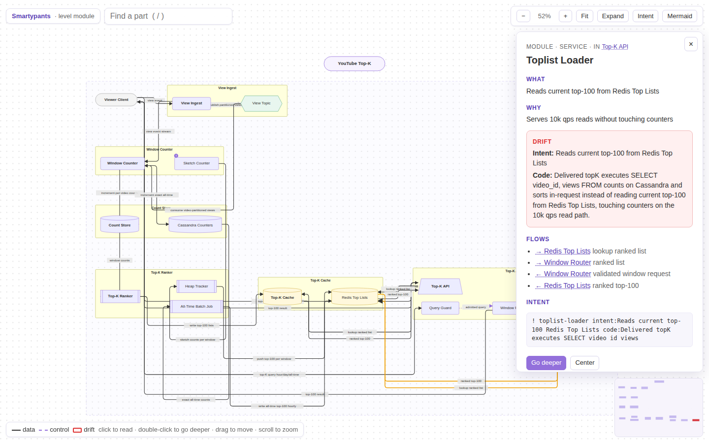
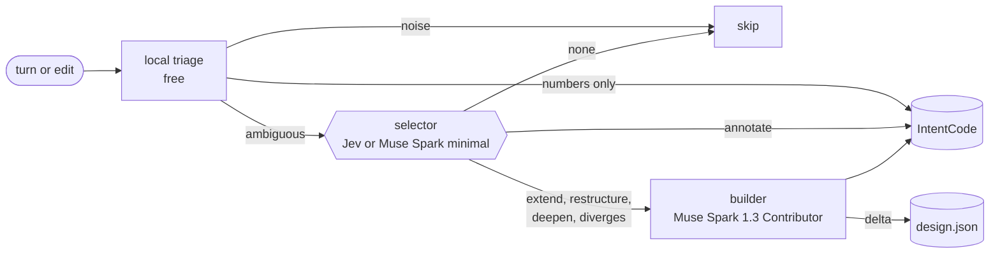

# Smartypants

A live system diagram for the project your coding agent is building. Smartypants listens to
the conversation and the edits, keeps a Mermaid-style diagram (system → component → module),
remembers your architectural intent in a compact code, goes deeper on any part when asked,
and flags where the code leaves the intent.


- **Cheap by design.** A free local triage and a Jev-style selector decide what each turn is
  worth. Greetings, "run the tests", and pure numbers never reach the builder; only turns that
  change the design do.
- **Meta by default.** The builder runs on the Meta Model API with **Muse Spark 1.3 in
  Contributor mode** (`muse-spark-1.3-contributor`, $0.10/M in, $0.20/M out).
- **Works in** Claude Code, Codex, Pi, Muse Code, and Grok Build.

## Start

```sh
npm install github:logan-robbins/smartypants
npx smartypants init            # meta builder, auto depth, background mode
export META_API_KEY=...         # Meta Model API key (or set envFile in the config)
npx smartypants serve           # open the printed URL
```

Then talk about the system in your agent: *"Design YouTube top-K: the 100 most viewed videos
in the last hour, day, and all time."* The canvas fills in. Say *"go deeper on the
aggregator"* (or double-click it) to expand it.

`init` writes `smartypants.config.json` and the host hooks (`.claude/settings.json`,
`.codex/hooks.json`, `.grok/hooks/smartypants.json`, `.muse/hooks.json`,
`.pi/extensions/smartypants/index.js`) without touching other hooks. Nothing happens in a
project without `smartypants.config.json`.

```json
{
  "flavor": "meta",
  "depth": "auto",
  "seed": false,
  "decider": "auto",
  "background": true,
  "model": null,
  "reasoningEffort": null
}
```

| key | values |
|---|---|
| `flavor` | builder: `meta` (default), `claude`, `codex`, `grok`, `muse`, `pi` |
| `depth` | `auto` (start from what the user said, go finer as they do), or a fixed `system`, `component`, `module` |
| `decider` | selector: `auto` (Jev if `TYPESAFE_API_KEY`, else Muse Spark if `META_API_KEY`, else local), `jev`, `meta`, `heuristic` |
| `background` | `true`: hooks return at once and a project worker does the work |
| `autoDeepen` | pressure that expands a part on its own (default `3`), or `false` |
| `model` | builder model; `muse-spark-1.3` for the standard (non-training) tier |
| `reasoningEffort` | override the per-call effort (`minimal` … `max`) |
| `intentTokens` | IntentCode budget (default 1200) |
| `seed` | `true` for an existing codebase: the first turn draws the tree as a baseline |
| `envFile` | dotenv path relative to the project; process env wins |
| `watch` | follow another Claude Code or Codex instance (below) |

| flavor | needs |
|---|---|
| `meta` | `META_API_KEY` (or `MODEL_API_KEY`) |
| `claude` | `@anthropic-ai/claude-agent-sdk`, `ANTHROPIC_API_KEY` |
| `codex` | `@openai/agents`, `OPENAI_API_KEY` |
| `grok` | `openai`, `XAI_API_KEY` |
| `muse` | `@muse-code/sdk` and the `muse` binary |
| `pi` | `@earendil-works/pi-coding-agent` and Pi's login |

## Commands

```
smartypants deeper <part>   go one level deeper (system → components → modules → notes)
smartypants intent          print the IntentCode memory
smartypants drift           list where code left the intent
smartypants mermaid         print the diagram as Mermaid source
smartypants stats           turns skipped, builder calls, tokens, cost
smartypants demo <example>  load youtube-top-k | uber | news-feed | messenger | url-shortener
smartypants reset           clear the diagram and memory, keep the config
```

In chat, *"go deeper on X"*, *"zoom into X"*, *"dig into X"*, and *"tell me more about X"* all
go deeper.

## The canvas

Mermaid's look on an infinite canvas: rounded services, cylinder stores and caches, hexagon
queues, stadium clients, trapezoid gateways, and components with modules drawn as yellow
subgraphs. Solid arrows carry data, dashed arrows control; drift is red.

- **Click** a box to read more: what, why, deep-dive notes, drift, flows, and the intent atoms
  about it. **Go deeper**, **Collapse/Expand**, and **Center** are in the panel.
- **Double-click** a box to go deeper. **Drag** a box to move it (the place is saved).
- **Scroll** to zoom, drag empty space or two-finger scroll to pan, **F** to fit, **/** to search,
  **I** for the intent memory and efficiency stats, the minimap to jump.
- **Mermaid** copies the diagram as Mermaid source.
- Long pipelines wrap into rows automatically; set `"direction": "TB"` in the design for top to bottom.



## How it decides



This is the WindTunnel [Jev + Mercury](https://github.com/nekuda-ai/WindTunnel/tree/main/results/2026-09-18-jev-mercury)
split applied to design memory: a selector picks from closed menus with a confidence, and the
writer only writes when the pick says something changed. Details:
[docs/ARCHITECTURE.md](docs/ARCHITECTURE.md), [docs/INTENTCODE.md](docs/INTENTCODE.md),
[docs/PROMPTING.md](docs/PROMPTING.md).

**IntentCode** keeps intent as typed, keyed atoms, grouped by subject:

```
sys|G top-100-videos hour-day-alltime|N load-views-day 1B views/day|N freshness <1min
aggregator|D flink count-min+min-heap|X sketch-for-alltime
topk-cache|D redis
```

A user who changes a decision evolves the intent (the old choice becomes `X`); code that
contradicts a `D`, `N`, or `X` atom is drift.

## Results

Live runs on the Meta Model API, 2026-09-26: [results/2026-09-26-meta-jev](results/2026-09-26-meta-jev/README.md).

| | Jev/Muse Spark selector | local rules only |
|---|---:|---:|
| held-out triage, exact (34 turns) | **30/34** | 18/34 |
| held-out "worth remembering" (keep vs skip) | **34/34** | 23/34 |
| held-out drift verdicts (10 edits) | **9/10**, 0 missed | 5/10, 1 missed |
| interview transcripts: triage · recall · drift | 32/32 · 33/33 · 10/10 | 32/32 · 33/33 · 9/10 |
| builder calls for 5 interviews (32 turns, 10 edits) | 27 | 29 |
| cost for 5 interviews | $0.016 | $0.013 |

The graph context the builder sees is 45% of the JSON size, and IntentCode keeps each
interview's intent in 133 to 222 tokens. Real Jev (`TYPESAFE_API_KEY`) was not available for
these runs.

## Hosts

| host | wiring | notes |
|---|---|---|
| Claude Code | `.claude/settings.json` or the plugin's hooks | verified with `claude -p` |
| Codex | `.codex/hooks.json` | approve the hooks once in Codex's startup hooks review; `apply_patch` edits are parsed |
| Pi | `.pi/extensions/smartypants/index.js`, or `pi install git:github.com/logan-robbins/smartypants` | Pi can itself run on Muse Spark (below) |
| Muse Code | `.muse/hooks.json` | the `muse` flavor drives Muse Code headless |
| Grok Build | `.grok/hooks/smartypants.json` | |

Pi on Muse Spark: put this in `~/.pi/agent/models.json` and run `pi --provider meta --model muse-spark-1.3-contributor`.

```json
{
  "providers": {
    "meta": {
      "baseUrl": "https://api.meta.ai/v1",
      "api": "openai-completions",
      "apiKey": "$META_API_KEY",
      "models": [{ "id": "muse-spark-1.3-contributor", "reasoning": true, "input": ["text"], "contextWindow": 262144, "maxTokens": 32768, "cost": { "input": 0.1, "output": 0.2, "cacheRead": 0.01, "cacheWrite": 0 } }]
    }
  }
}
```

## Plugins

Claude Code:

```
/plugin marketplace add logan-robbins/smartypants
/plugin install smartypants@smartypants
```

The plugin adds `/smartypants` (set up), `/smartypants:deeper`, `/smartypants:intent`,
`/smartypants:drift`, `/smartypants:diagram`, `/smartypants:mermaid`, `/smartypants:reset-graph`,
and hooks that forward turns to the project's installed Smartypants (no-op without a config).

Codex: `codex plugin marketplace add logan-robbins/smartypants` then
`codex plugin add smartypants@smartypants`. Grok Build: `grok plugin marketplace add
logan-robbins/smartypants` then `grok plugin install smartypants --trust`. Cursor: submit
`plugins/smartypants` at https://cursor.com/marketplace/publish. Submission status and the
remaining owner steps: [SUBMISSION.md](SUBMISSION.md).

## Watching another agent

To diagram a separate Claude Code or Codex instance, add `watch` with that instance's home:

```json
{ "flavor": "meta", "depth": "auto", "watch": { "host": "claude", "home": "/absolute/path/to/claude-home" } }
```

Use `"host": "codex"` for Codex, or `"session": "/absolute/session.jsonl"` for one session.
The canvas server follows new user turns; offsets (never text) go in
`.smartypants/watch-state.json`. The watched instance needs no hook.

## Watching an hx Partner

The hx Partner has a Claude home at `<hx-instance>/run/partner/home`. Point the
working project's Smartypants config at that directory:

```json
{
  "flavor": "meta",
  "depth": "auto",
  "seed": false,
  "watch": {"host":"claude","home":"/absolute/path/to/hx-instance/run/partner/home"}
}
```

Restart the Smartypants server after editing the config. Tell the Partner the project
path so it records the default work location. Tmux prompts and hx UI chat messages
appear in the Partner transcript and reach the project diagram. Verify the Partner
session has `main` and `companion` windows, both UI URLs respond, and the Smartypants
server reports the watched home. A greeting can be observed while leaving the canvas
empty because it provides no design information. Keep the hx instance outside the
project when practical so a future `--seed` scan does not include harness files.

## Files

- `smartypants.config.json`: the on switch.
- `.smartypants/design.json`: the diagram.
- `.smartypants/intent.json`: IntentCode atoms, never a transcript.
- `.smartypants/stats.json`: skipped turns, calls, tokens, cost.
- `.smartypants/queue.jsonl`, `worker.lock`: background mode.

## Hook rules

- Exit 0. Never block or rewrite the user turn.
- A builder failure leaves the previous design on disk.
- The same result twice does not add a second copy of a node.
- A drift flag states the intent and how the code differs, once per divergence; a divergence
  no node owns is kept as unmapped.

## Develop

```sh
npm test                       # 60 tests, no network
npm run eval                   # live transcripts on the Meta API (a few cents)
npm run eval:triage            # held-out triage benchmark
```
