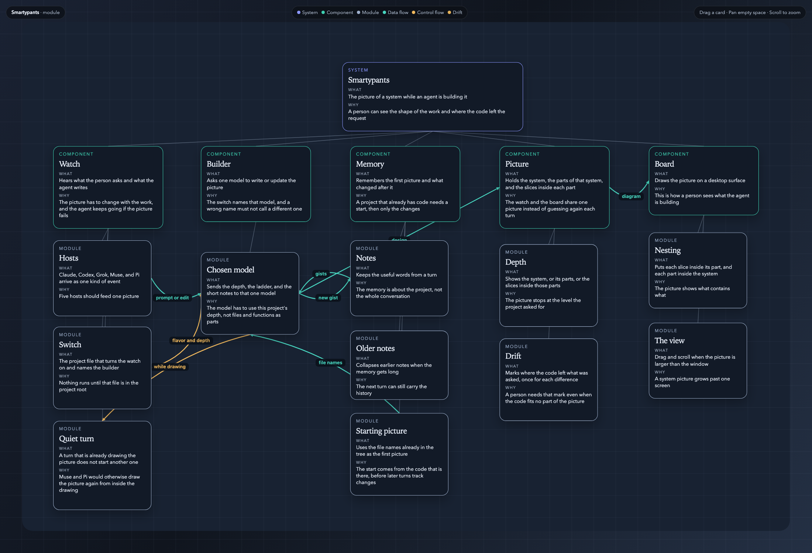

# Smartypants

Keep a system diagram while an agent codes. Flag where the code leaves the request.



The picture is a Bitly-style URL shortener. A person gets a short link. A click on that link is sent to the original page, and the owner can see that it was used.

The hook does nothing until `smartypants.config.json` is in the project root.

## Start

1. Install the package in the project.

```sh
npm install github:logan-robbins/smartypants
```

The package name is `@logan-robbins/smartypants`. The npm name `smartypants` belongs to a different library.

2. Wire the config and the host hooks. This writes `smartypants.config.json` when it is missing, and adds the hook without removing other hooks.

```sh
npx smartypants init --flavor claude
```

Use `--seed` when the project already has code. Use `--flavor` `claude`, `codex`, `grok`, `muse`, or `pi`.

3. Edit `smartypants.config.json` if you need to change the starter.

```json
{
  "flavor": "claude",
  "depth": "module",
  "seed": false,
  "model": null,
  "reasoningEffort": null
}
```

To use API keys from a local dotenv file, set `"envFile": "../.env"` in
`smartypants.config.json` (the path is relative to the project). Existing process
environment variables take precedence. The file is read when a hook runs; keys
are never copied into the diagram or ledger. `GROK_API_KEY` is accepted as an
alias for `XAI_API_KEY`, and `ANTRHOPIC_API_KEY` for `ANTHROPIC_API_KEY`.

- `flavor`: `claude`, `codex`, `grok`, `muse`, or `pi`. Use one. An unknown value does not call another.
- `depth`: `module` (default), `component`, or `system`.
- `seed`: `true` when the project already has code. The first turn draws that tree as the baseline. Later turns store only the delta. `false` when the design starts from the conversation.
- `model`: optional model ID for the selected flavor.
- `reasoningEffort`: optional reasoning effort for the Codex flavor: `none`, `low`, `medium`, `high`, `xhigh`, or `max`.

4. Install the SDK for that flavor.

| flavor | install | key |
| --- | --- | --- |
| `claude` | `@anthropic-ai/claude-agent-sdk` | `ANTHROPIC_API_KEY` |
| `codex` | `@openai/agents` | `OPENAI_API_KEY` |
| `grok` | `openai`, base URL `https://api.x.ai/v1` | `XAI_API_KEY` |
| `muse` | `@muse-code/sdk` plus a `muse` binary on `PATH` | |
| `pi` | `@earendil-works/pi-coding-agent` | Pi's own login |

5. `npx smartypants init` writes these host files. Run it again after you move `node_modules`. Codex hooks need the `codex_hooks` feature and do not run on Windows. Pi loads `.pi/extensions/smartypants/index.js`.

| host | file |
| --- | --- |
| Claude Code | `.claude/settings.json` |
| Codex | `.codex/hooks.json` |
| Grok Build | `.grok/hooks/smartypants.json` |
| Muse Code | `.muse/hooks.json` |
| Pi | `.pi/extensions/smartypants/index.js` |

6. Open the diagram.

```sh
npx smartypants serve
```

Clear the diagram and start it over with `/reset-graph` or:

```sh
npx smartypants reset
```

Open http://127.0.0.1:4173. Drag a card to move that card. Drag empty space to pan. Scroll to zoom.

An arrow points the way the data moves. A reply or a write-back is a second arrow pointing back at the caller. Ink arrows are data. Amber arrows are control.

- The browser sends a long URL to Create link. Create link asks Code mint for a code, and the short code comes back.
- Create link saves the code and the long URL in the link table. The table answers that it saved. Create link hands the short link back to the browser.
- A click sends the short code to Redirect. Redirect asks the hot cache, and a hit comes back as the cached URL.
- On a miss, Redirect reads the link table and the stored URL comes back. Redirect tells the cache to remember it.
- Redirect sends the browser on to the original page, and sends the click to the click stream. The stream feeds Tallies.

## Skill

The skill in `plugins/smartypants` runs the start steps. `/smartypants reset` and `/reset-graph` clear the diagram and the gist ledger. They leave `smartypants.config.json`.

Claude Code:

```
/plugin marketplace add logan-robbins/smartypants
/plugin install smartypants@smartypants
```

Codex:

```sh
codex plugin marketplace add logan-robbins/smartypants
codex plugin add smartypants@smartypants
```

Grok Build:

```sh
grok plugin marketplace add logan-robbins/smartypants
grok plugin install smartypants --trust
```

Cursor: submit https://github.com/logan-robbins/smartypants at https://cursor.com/marketplace/publish. The plugin directory is `plugins/smartypants`.

Claude Code, Codex, and Grok Build install from this repository. Two directories still need a signed-in review:

- Anthropic community catalog: https://platform.claude.com/plugins/submit
- OpenAI directory for ChatGPT and Codex: https://platform.openai.com/plugins

## Levels

- **system**: the whole application a person would name.
- **component**: one job other parts can use without its internals. Not a file or a function.
- **module**: one slice of that job, inside exactly one component. Above files, classes, functions, and endpoints.

Each node has `what` and `why`. Both are required. They are not the same sentence.

## Files

- `smartypants.config.json` — the on switch.
- `.smartypants/design.json` — the diagram.
- `.smartypants/ledger.json` — gists only. Folded near 10000 tokens. Never a transcript.

## Hook rules

- Exit 0. Do not block or rewrite the user turn.
- A builder failure leaves the previous design on disk.
- The same result twice does not add a second copy of a node.
- A drift flag states the intent and how the code differs. Store each divergence once. Keep a divergence that fits no node.
