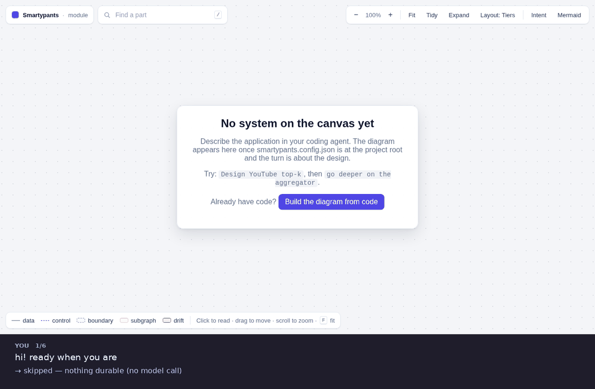
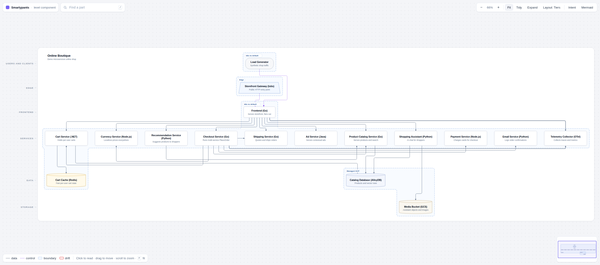
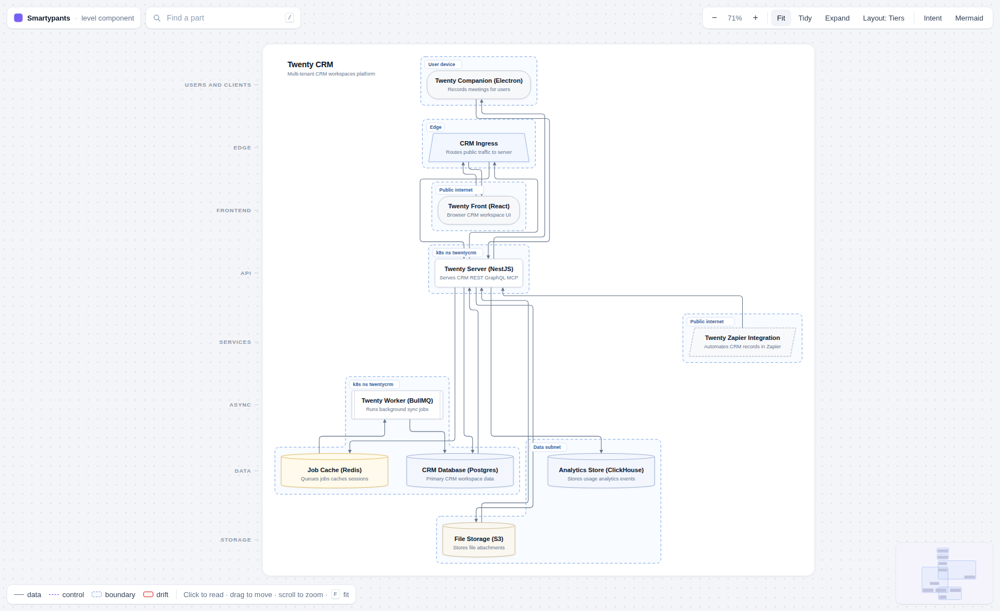
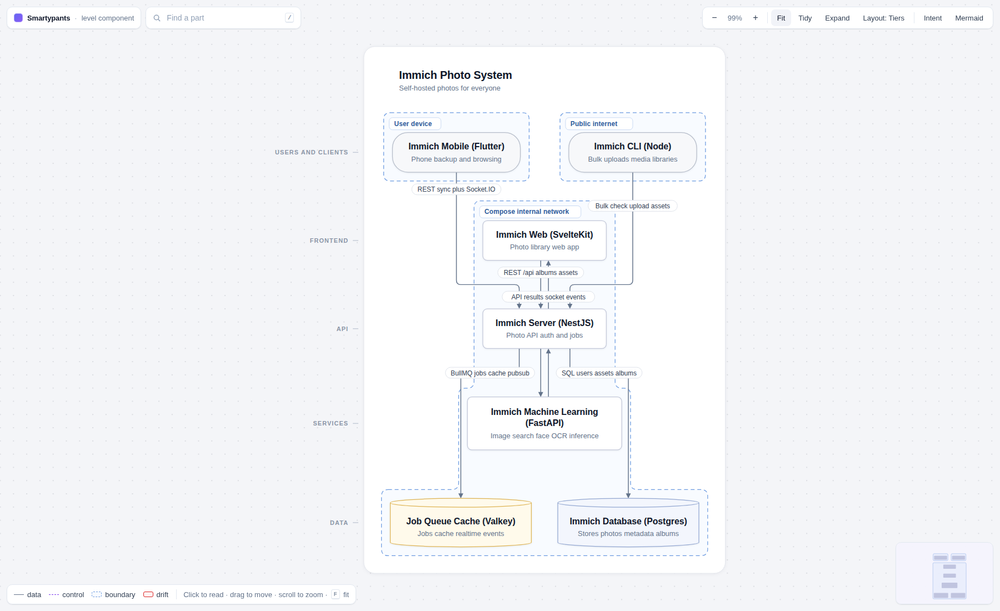
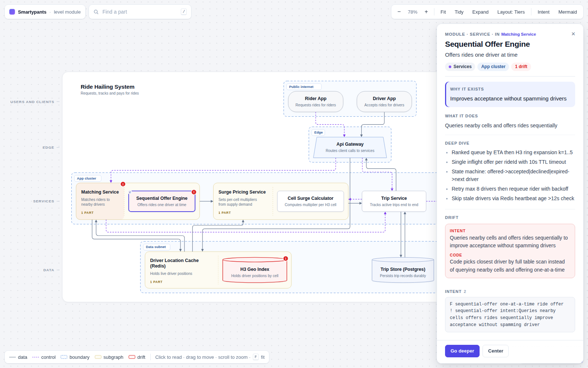

# Smartypants

**The architecture diagram that draws itself while your coding agent works — and tells you when
the code wanders.**

Your agent forgets what you asked for. Smartypants doesn't. It hooks into Claude Code, Codex, Pi,
Muse Code, and Grok Build, keeps one layered diagram of the system current on every turn, and
flags the moment a diff leaves the design you described.

[**Live demo**](https://logan-robbins.github.io/smartypants/) · [Install](#install) · [How it compares](#how-it-compares) ·
[Proof](#proof) · [What leaves your machine](#what-leaves-your-machine)



- **Live, not a snapshot.** Prompts, edits, and the end of every agent turn update the diagram in
  the background. Your agent never waits.
- **Drift against what you said.** Decisions and constraints from the conversation are kept as
  IntentCode (~200 tokens per design). At turn end, one batched check reads what changed in git;
  code that breaks a decision, a constraint, or a boundary turns red.
- **Catches up on existing repos.** From code plus compose, Kubernetes, Helm, and Terraform: real
  service names, flows, and network boundaries, in about a minute for about a cent.
- **Reads like a staff engineer drew it.** Users on top, storage at the bottom, the journey left
  to right, boundaries as frames. Each box has a plain name and one line; click it for the **why**.

## Install

```sh
npm install -D @logan-robbins/smartypants
npx smartypants init        # hooks for every host + config; catches up if code exists
npx smartypants serve       # open the printed URL
```

**The model is Claude, signed in the way your Claude Code already is.** Smartypants runs this
machine's `claude` CLI headless (tool-less, settings-less, one answer per call), so whatever
Claude Code uses works with no extra key: `ANTHROPIC_API_KEY`, Bedrock / Vertex / Foundry, a
gateway on `ANTHROPIC_BASE_URL`, or your `claude` login. Two roles:

- **Decisions:** Claude Sonnet 5.5 at high effort answers the small per-turn questions (is this
  worth remembering, does this diff conform). ~3 s and ~$0.003–0.01 each, and the most accurate
  setting we measured ([results](results/2026-10-07-sonnet-decider/README.md)).
- **Writing:** Claude Code's default model for your sign-in writes the diagram and drift notes,
  only when a decision says there is work. Pin it with `"model"`.

On another harness without Claude Code, pick its builder with `init --flavor codex|pi|grok|meta`
([Config](#config)).

**Alternative: Typesafe Jev for the decisions.** ~0.2 s per decision for a fraction of a cent;
Claude still writes, and answers the decisions itself if Jev is unreachable:

1. Sign in at [console.typesafe.ai/keys](https://console.typesafe.ai/keys) and create an API key.
2. `export TYPESAFE_API_KEY=...` in the shell that starts your agent (or put it in a dotenv file
   and set `"envFile"`, or enter it in the Claude Code plugin's "Typesafe (Jev) API key" setting).
3. Set `"decider": "jev"` in `smartypants.config.json` and restart the agent session.

Or as a plugin: `/plugin marketplace add logan-robbins/smartypants` then
`/plugin install smartypants@smartypants` (Claude Code) ·
`codex plugin marketplace add logan-robbins/smartypants` (Codex) ·
`pi install git:github.com/logan-robbins/smartypants` (Pi) ·
`npx skills add logan-robbins/smartypants` (any skills host).

**No key? See it first:** `npx smartypants demo youtube-top-k && npx smartypants serve`, or the
[live demo](https://logan-robbins.github.io/smartypants/) (source in `site/`).

Then just work. Say *"design YouTube top-K"* and the diagram appears; say *"go deeper on the
aggregator"* (or double-click it) to expand a box; let the agent code and watch for red.

## How it compares

| | **Smartypants** | Archify | drawio-skill | Whiteboard | GitDiagram · DeepWiki | ArchUnit · dep-cruiser |
|---|---|---|---|---|---|---|
| Updates by itself as the agent works | **every turn, via hooks** | on request | on request | on request | on request | in CI |
| Knows what you asked for | **yes (IntentCode)** | chat context | no | decision log | no | rules you write |
| Flags drift | **per turn, vs your intent** | before/after diff | diagram diff | no | no | rule violations |
| Existing repo + Helm/k8s/compose/TF | **yes, background** | repo | code + IaC | repo | repo | code only |
| Output | layered interactive canvas, Mermaid export | animated HTML | draw.io | desktop canvas | web diagram / wiki | test failures |

Archify draws a great poster; Smartypants keeps the map and sounds the alarm. Details and
sources: [docs/research/competitors.md](docs/research/competitors.md).

## Proof

Live runs, Claude Sonnet 5.5 deciding and Claude writing ([results](results/2026-10-07-sonnet-decider/README.md) ·
[Jev deciding](results/2026-10-02-claude/README.md) ·
[with Muse Spark writing](results/2026-10-02-jev-muse/README.md) ·
[selector benchmarks](results/2026-09-27-jev/README.md)):

| | result |
|---|---|
| Stop-hook review of labeled agent changes × 2, end to end | **22/22 drift flags right, 0 missed, 0 false alarms**, 10.2 s per turn (Jev deciding: 22/22, 7.3 s) |
| Held-out triage, 34 turns + 10 edits | Sonnet 5.5 high: **32/34 exact, 34/34 keep-vs-skip, 9/10 drift verdicts, 0 missed** (Jev: 29/34 per rep; local rules alone 18/34) |
| Per-turn decision | Sonnet 5.5 high ~3 s, ~$0.003–0.01; Jev ~0.2 s |
| Five design interviews (32 turns, 10 edits), Muse Spark writing | triage 32/32, all 33 expected parts drawn, drift 10/10, $0.015 total |
| Noise turns ("thanks", "run the tests") | **$0**, no model call |
| Catch-up on 10 open-source repos | 36–115 s, $0.001–0.011 each ([crawler notes](docs/crawl/)) |

Caught up from code alone — GoogleCloudPlatform/microservices-demo (11 services, Istio gateway,
AlloyDB, GCS), twenty, and immich:

<p>



</p>

## The canvas

| top to bottom | |
|---|---|
| Users and clients | who starts the journey |
| Edge | CDN, WAF, load balancer, ingress, gateway |
| Frontend → API → Services | third parties at the right edge |
| Async | streams first, then the workers that consume them |
| Data | caches beside the databases they front |
| Storage | always the bottom row |

Inside a row the journey runs left to right. Dashed frames are network and trust boundaries.
Everything is clickable and draggable — boxes, subgraphs, arrows, frames, layer labels. A click
leads with **why the part exists** (the requirement or trade-off that forces it), then what it
does, deep-dive notes, flows, drift, and the intent recorded about it.



Keys: **F** fit · **T** tidy · **L** tiers/flow layout · **I** intent memory · **/** search ·
double-click to go deeper.

## What leaves your machine

Nothing, in a project without `smartypants.config.json`. With the default `claude` builder:
design turns, part names, changed-file diffs at turn end, and (for catch-up) key source files go
to Claude through your own Claude Code, under the same account, provider, and data terms it
already uses. Smartypants never reads or stores a Claude credential. With `"decider": "jev"`,
per-turn triage questions (turn text, part names) go to Typesafe (Jev). With the `meta` builder
they go to **api.meta.ai**, whose default `muse-spark-1.3-contributor` tier **may be used for
training** (`"model": "muse-spark-1.3"` opts out). Keys are never written to the diagram, memory,
or logs; the plugin stores the ones you enter in your OS credential store.

## Commands

```
smartypants catchup     build the diagram from existing code, in the background
smartypants review      review what the working tree changed, now
smartypants deeper X    system → components → modules → deep-dive notes
smartypants intent      print the IntentCode memory
smartypants drift       list where code left the intent
smartypants mermaid     export Mermaid
smartypants stats       turns skipped, calls, tokens, cost
smartypants demo NAME   shop-monorepo · youtube-top-k · uber · news-feed · messenger · url-shortener
smartypants reset       clear the diagram and memory
```

Plugin commands mirror these: `/smartypants`, `/smartypants:deeper`, `:catchup`, `:review`,
`:intent`, `:drift`, `:diagram`, `:mermaid`, `:reset-graph`.

## Config

`smartypants.config.json` is the on switch. `init` writes:

```json
{ "flavor": "claude", "depth": "auto", "seed": false, "decider": "auto", "deciderModel": "claude-sonnet-5-5", "deciderEffort": "high", "background": true, "review": "turn" }
```

| key | meaning |
|---|---|
| `flavor` | builder: `claude` (default; this machine's Claude Code and its sign-in), `codex` (`OPENAI_API_KEY`), `pi`, `grok` (`XAI_API_KEY`), `meta` (Muse Spark, `META_API_KEY`), `muse` |
| `model` | builder model; unset = Claude Code's default for your sign-in (e.g. `claude-opus-5-5`, or an alias like `sonnet`) |
| `depth` | `auto` (start from what you said, go finer as you do) or `system` / `component` / `module` |
| `decider` | who answers the per-turn menus: `auto` (with the claude builder: Claude, then local rules), `jev` (Typesafe Jev with `TYPESAFE_API_KEY`; Claude if Jev is unreachable), `claude`, `meta`, `heuristic` |
| `deciderModel` | the Claude model for those menus; default `claude-sonnet-5-5` |
| `deciderEffort` | `low` · `medium` · `high` (default) · `xhigh` · `max` |
| `review` | `turn` (once per agent turn), `edit` (every edit), `both` |
| `background` | hooks return immediately; a project worker does the work |
| `seed` | existing codebase: catch up from code |
| `autoDeepen` | expand a box on its own when detail piles up (default 3; `false` to disable) |
| `envFile` | dotenv path for keys |
| `watch` | diagram another Claude Code / Codex instance ([docs/WATCH.md](docs/WATCH.md)) |

## Hosts

| host | hooks | notes |
|---|---|---|
| Claude Code | prompt, edit, `Stop` | project settings or the plugin |
| Codex | prompt, `apply_patch`, `Stop` | approve the hooks once in Codex's hooks review |
| Pi | `input`, `tool_result`, `agent_end` | project extension or `pi install`; Pi itself can run on Muse Spark |
| Muse Code, Grok Build | prompt, edit | `.muse/hooks.json`, `.grok/hooks/smartypants.json` |

## How it works

Two jobs, the way WindTunnel pairs a selector (Jev) with a writer (Mercury): **one model decides,
Claude writes.** A free local pass drops noise. The selector, Claude Sonnet 5.5 at high effort
by default or Typesafe Jev as the alternative, then answers small closed menus: is this worth
remembering, does it change the design, at what level, which part, does this diff conform. The
writer runs only when the selector says there is work, and writes it: the diagram delta, the
drift note, the IntentCode. An unsure pick leans toward doing the work, and the writer decides
what actually lands, so a borderline file costs one write rather than a missed drift.
Details: [docs/ARCHITECTURE.md](docs/ARCHITECTURE.md) · [docs/INTENTCODE.md](docs/INTENTCODE.md) ·
[docs/PROMPTING.md](docs/PROMPTING.md) · go-to-market: [docs/GTM.md](docs/GTM.md).

## Develop

```sh
npm test                      # no network, no sign-in (a fake claude CLI stands in)
npm run eval                  # live interview transcripts on the Meta API (cents)
npm run eval:triage           # held-out triage benchmark
npm run eval:turnend          # turn-end review on labeled agent changes
node scripts/build-site.mjs   # website demo into site/demo
```

## License

[Apache-2.0](LICENSE). Use it, fork it, ship it; keep the [NOTICE](NOTICE) with any copy or
derivative so the credit travels with it. Citing it: [CITATION.cff](CITATION.cff).
