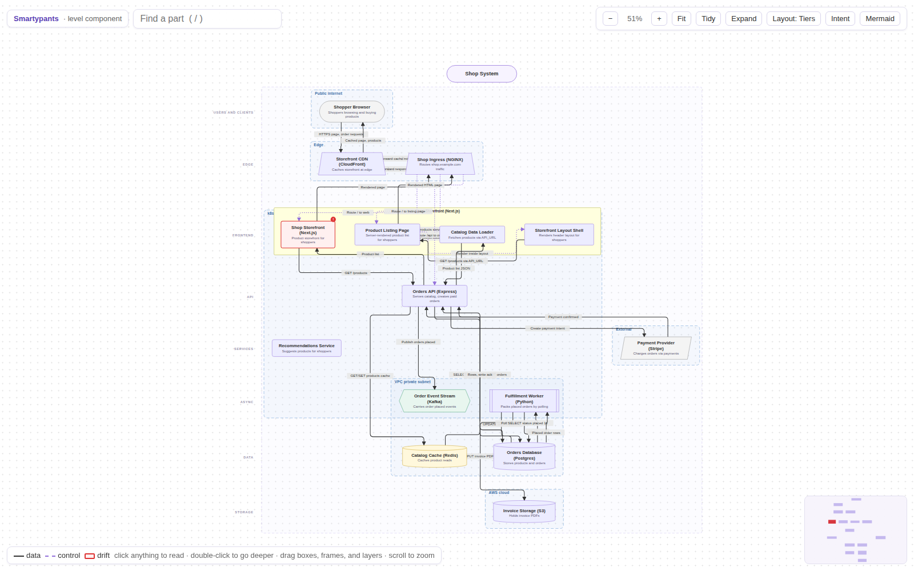
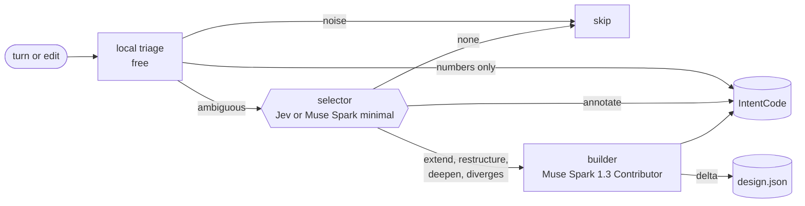

# Smartypants

A live architecture diagram for the project your coding agent is building. Smartypants listens
to the conversation and the working tree, draws the system in layers the way a staff engineer
would, remembers what you intended in a compact code, reviews every agent turn for drift, and
catches up from an existing codebase — services, Helm charts, Kubernetes, compose, and
Terraform included.

**Website and live demo:** [`site/`](site/index.html) (published to GitHub Pages by
`.github/workflows/pages.yml`).



- **Readable at a glance.** Every box has a plain name and a one-line description; click
  anything for the details.
- **One layout convention.** Users on top, then edge, frontend, API, services, async, data, and
  storage at the bottom; the journey runs left to right; network and trust boundaries are frames.
- **Knows your code.** Catch-up builds the whole diagram from an existing repo in the background;
  a review at the end of every turn checks what changed in git against the design.
- **Cheap by design.** A free local triage and a Jev-style selector decide what each turn is
  worth. Only turns and changes that move the design reach the builder.
- **Meta by default.** The builder runs on the Meta Model API with **Muse Spark 1.3 in
  Contributor mode** (`muse-spark-1.3-contributor`, $0.10/M in, $0.20/M out).
- **Works in** Claude Code, Codex, Pi, Muse Code, and Grok Build.

## Start

```sh
npm install github:logan-robbins/smartypants
npx smartypants init            # hooks, config, and catch-up when code already exists
export META_API_KEY=...         # Meta Model API key (or set envFile in the config)
npx smartypants serve           # open the printed URL
```

**Existing project?** `init` notices the code (8 or more source files) and starts a
background **catch-up**: it maps the code and infrastructure without a model, reads each code
unit with one builder call, and draws the baseline diagram — about a minute and a few tenths of
a cent for a small monorepo. The canvas shows progress; `npx smartypants catchup` runs it again,
and an empty canvas has a **Build the diagram from code** button.

**New project?** Talk about the system in your agent: *"Design YouTube top-K: the 100 most viewed videos
in the last hour, day, and all time."* The canvas fills in. Say *"go deeper on the
aggregator"* (or double-click it) to expand it.

`init` writes `smartypants.config.json` and the host hooks (`.claude/settings.json`,
`.codex/hooks.json`, `.grok/hooks/smartypants.json`, `.muse/hooks.json`,
`.pi/extensions/smartypants/index.js`) without touching other hooks: user prompts, edits, and
the end of each turn (`Stop` in Claude Code and Codex, `agent_end` in Pi). Nothing happens in a
project without `smartypants.config.json`.

```json
{
  "flavor": "meta",
  "depth": "auto",
  "seed": false,
  "decider": "auto",
  "background": true,
  "review": "turn",
  "model": null,
  "reasoningEffort": null
}
```

| key | values |
|---|---|
| `flavor` | builder: `meta` (default), `claude`, `codex`, `grok`, `muse`, `pi` |
| `depth` | `auto` (start from what the user said, go finer as they do), or a fixed `system`, `component`, `module` |
| `decider` | selector: `auto` (Jev if `TYPESAFE_API_KEY`, else Muse Spark if `META_API_KEY`, else local), `jev`, `meta`, `heuristic` |
| `background` | `true`: hooks return at once and a project worker does the work |
| `review` | `turn` (default for new projects): review the working tree once at the end of each agent turn; `edit`: check every edit as it happens; `both` |
| `autoDeepen` | pressure that expands a part on its own (default `3`), or `false` |
| `model` | builder model; `muse-spark-1.3` for the standard (non-training) tier |
| `reasoningEffort` | override the per-call effort (`minimal` … `max`) |
| `intentTokens` | IntentCode budget (default 1200) |
| `seed` | `true` for an existing codebase; `init` sets it and starts catch-up when it finds code |
| `envFile` | dotenv path relative to the project; process env wins |
| `watch` | follow another Claude Code or Codex instance (below) |

| flavor | needs |
|---|---|
| `meta` | `META_API_KEY` (or `MODEL_API_KEY`) |
| `claude` | `@anthropic-ai/claude-agent-sdk`, `ANTHROPIC_API_KEY` |
| `codex` | `@openai/agents`, `OPENAI_API_KEY` |
| `grok` | `openai`, `XAI_API_KEY` |
| `muse` | `@muse-code/sdk` and the `muse` binary |
| `pi` | `@earendil-works/pi-coding-agent` and Pi's login |

## Commands

```
smartypants catchup         build the diagram from the existing code, in the background
smartypants review          review what the working tree changed, now
smartypants deeper <part>   go one level deeper (system → components → modules → notes)
smartypants intent          print the IntentCode memory
smartypants drift           list where code left the intent
smartypants mermaid         print the diagram as Mermaid source
smartypants stats           turns skipped, builder calls, tokens, cost
smartypants demo <example>  load shop-monorepo | youtube-top-k | uber | news-feed | messenger | url-shortener
smartypants reset           clear the diagram and memory, keep the config
```

In chat, *"go deeper on X"*, *"zoom into X"*, *"dig into X"*, and *"tell me more about X"* all
go deeper.

## The canvas

Mermaid's look on an infinite canvas, laid out by one convention:

| row, top to bottom | what goes there |
|---|---|
| Users and clients | people, apps, devices — who starts the journey |
| Edge | CDN, DNS, WAF, load balancers, ingress, API gateways |
| Frontend | web UI, above the API it calls |
| API | public APIs and backends-for-frontends |
| Services | domain and platform services; third parties at the right edge |
| Async | streams and queues on the left, then the workers that consume them |
| Data | caches beside the databases they front |
| Storage | objects, files, archives, warehouses — always the bottom row |

Inside a row the request journey runs left to right, as long as it needs to. Dashed blue frames
are network and trust boundaries (public internet, edge, cluster namespaces, private subnets),
taken from what you said or from the Kubernetes, Helm, compose, and Terraform files. Components
with modules are yellow subgraphs. Shapes follow the part: rounded services, cylinder stores and
caches, hexagon queues, stadium clients, trapezoid gateways, parallelogram third parties. Solid
arrows carry data, dashed arrows control; a reply is its own arrow back to the caller; drift is red.

Every box shows a readable name ("Orders API (Express)", "Invoice Storage (S3)") and a one-line
description. Everything on the canvas is clickable and movable:

| click | opens | drag |
|---|---|---|
| a box | what, why, deep-dive notes, layer and zone, drift, parts inside, flows, intent | moves the box |
| a subgraph title | the component | moves the component with its modules |
| an arrow | the payload, both ends, the reply, and any boundary it crosses | — |
| a boundary frame | the boundary and what is inside | moves everything inside |
| a layer label | the layer and its parts | moves the whole layer |
| the system frame or title | the system | moves the whole picture |
| a drift card | the unmapped divergence | moves the card |

Positions are saved. **Tidy** (T) forgets them and lays everything out again; **Layout** (L)
switches between tiers and a left-to-right flow. Double-click a box to go deeper. Scroll to zoom,
drag empty space to pan, **F** fits, **/** searches, **I** shows the intent memory and efficiency
stats, **Mermaid** copies the diagram as Mermaid source.


## Knowing the code

**Catch-up** (existing projects): a local scan maps units (manifests and their notable
dependencies: HTTP frameworks, SQL and NoSQL drivers, Redis, Kafka, object storage, payment
providers, auth, observability), routes, tables, topics, and environment endpoints, plus the
infrastructure: compose services and networks; Kubernetes Deployments, Services, Ingress,
NetworkPolicies, and namespaces; Helm charts, their templates, values, and subcharts; Terraform
resources such as VPCs, subnets, security groups, load balancers, and managed databases. That map
names the network boundaries without a model. Then one builder call per code unit reads its key
files, and one synthesis call draws the baseline with layers, zones, and flows.

**Turn-end review**: when the agent finishes a turn, Smartypants looks at what the turn changed
in git — dirty and untracked files and new commits — skipping anything it already reviewed.
Tests, docs, lockfiles, and agent config cost nothing. The rest gets **one batched Jev-protocol
call** with a verdict per file (conforms, diverges, new boundary, not architectural). Diverging
files go to one drift check together; new boundaries and infrastructure changes (Helm, k8s,
compose, Terraform, Dockerfiles) go to one design sync with a fresh infrastructure map. If you
asked for the change in chat first, the design already evolved and the code is not drift.

## How it decides


```mermaid
flowchart LR
  turn(["turn or edit"]) --> local["local triage<br/>free"]
  local -->|"noise"| skip["skip"]
  local -->|"numbers only"| remember[("IntentCode")]
  local -->|"ambiguous"| jev{{"selector<br/>Jev or Muse Spark minimal"}}
  jev -->|"none"| skip
  jev -->|"annotate"| remember
  jev -->|"extend, restructure,<br/>deepen, diverges"| builder["builder<br/>Muse Spark 1.3 Contributor"]
  builder -->|"delta"| diagram[("design.json")]
  builder --> remember
```

This is the WindTunnel [Jev + Mercury](https://github.com/nekuda-ai/WindTunnel/tree/main/results/2026-09-18-jev-mercury)
split applied to design memory: a selector picks from closed menus with a confidence, and the
writer only writes when the pick says something changed. Details:
[docs/ARCHITECTURE.md](docs/ARCHITECTURE.md), [docs/INTENTCODE.md](docs/INTENTCODE.md),
[docs/PROMPTING.md](docs/PROMPTING.md).

**IntentCode** keeps intent as typed, keyed atoms, grouped by subject:

```
sys|G top-100-videos hour-day-alltime|N load-views-day 1B views/day|N freshness <1min
aggregator|D flink count-min+min-heap|X sketch-for-alltime
topk-cache|D redis
```

A user who changes a decision evolves the intent (the old choice becomes `X`); code that
contradicts a `D`, `N`, or `X` atom is drift.

## Results

Live runs on the Meta Model API: [results/2026-09-27-tiers](results/2026-09-27-tiers/README.md)
(current schema with names, descriptions, layers, and zones) and
[results/2026-09-26-meta-jev](results/2026-09-26-meta-jev/README.md).

| | Jev/Muse Spark selector | local rules only |
|---|---:|---:|
| held-out triage, exact (34 turns) | **31/34** | 18/34 |
| held-out "worth remembering" (keep vs skip) | **34/34** | 23/34 |
| held-out drift verdicts (10 edits) | **9/10**, 0 missed | 6/10, 0 missed |
| interview transcripts: triage · recall · drift | 32/32 · 33/33 · 9/10 | 32/32 · 33/33 · 9/10 |
| builder calls for 5 interviews (32 turns, 10 edits) | 26 | 30 |
| cost for 5 interviews | $0.015 | $0.015 |
| catch-up of `examples/shop-monorepo` (3 code units + compose, k8s, Helm, Terraform) | 12 parts, 20 flows, 5 zones; 4 calls, $0.003, about a minute | |
| turn-end review of 3 changed files (1 drift, 1 test, 1 new k8s Deployment) | 1 selector call, 1 drift check, 1 design sync; 23 s | |

The graph context the builder sees is 41% of the JSON size, and IntentCode keeps each
interview's intent in 126 to 232 tokens. Real Jev (`TYPESAFE_API_KEY`) was not available for
these runs.

## Hosts

| host | wiring | notes |
|---|---|---|
| Claude Code | `.claude/settings.json` or the plugin's hooks (prompt, edits, `Stop`) | verified with `claude -p` |
| Codex | `.codex/hooks.json` (prompt, `apply_patch`, `Stop`) | approve the hooks once in Codex's startup hooks review and trust the project; verified with `codex exec` |
| Pi | `.pi/extensions/smartypants/index.js`, or `pi install git:github.com/logan-robbins/smartypants` (`input`, `tool_result`, `agent_end`) | Pi can itself run on Muse Spark (below) |
| Muse Code | `.muse/hooks.json` | the `muse` flavor drives Muse Code headless |
| Grok Build | `.grok/hooks/smartypants.json` | |

Pi on Muse Spark: put this in `~/.pi/agent/models.json` and run `pi --provider meta --model muse-spark-1.3-contributor`.

```json
{
  "providers": {
    "meta": {
      "baseUrl": "https://api.meta.ai/v1",
      "api": "openai-completions",
      "apiKey": "$META_API_KEY",
      "models": [{ "id": "muse-spark-1.3-contributor", "reasoning": true, "input": ["text"], "contextWindow": 262144, "maxTokens": 32768, "cost": { "input": 0.1, "output": 0.2, "cacheRead": 0.01, "cacheWrite": 0 } }]
    }
  }
}
```

## Plugins

Claude Code:

```
/plugin marketplace add logan-robbins/smartypants
/plugin install smartypants@smartypants
```

The plugin adds `/smartypants` (set up), `/smartypants:deeper`, `/smartypants:catchup`,
`/smartypants:review`, `/smartypants:intent`, `/smartypants:drift`, `/smartypants:diagram`,
`/smartypants:mermaid`, `/smartypants:reset-graph`, and hooks that forward prompts, edits, and
turn ends to the project's installed Smartypants (no-op without a config).

Codex: `codex plugin marketplace add logan-robbins/smartypants` then
`codex plugin add smartypants@smartypants`. Grok Build: `grok plugin marketplace add
logan-robbins/smartypants` then `grok plugin install smartypants --trust`. Cursor: submit
`plugins/smartypants` at https://cursor.com/marketplace/publish. Submission status and the
remaining owner steps: [SUBMISSION.md](SUBMISSION.md).

## Watching another agent

To diagram a separate Claude Code or Codex instance, add `watch` with that instance's home:

```json
{ "flavor": "meta", "depth": "auto", "watch": { "host": "claude", "home": "/absolute/path/to/claude-home" } }
```

Use `"host": "codex"` for Codex, or `"session": "/absolute/session.jsonl"` for one session.
The canvas server follows new user turns; offsets (never text) go in
`.smartypants/watch-state.json`. The watched instance needs no hook.

## Watching an hx Partner

The hx Partner has a Claude home at `<hx-instance>/run/partner/home`. Point the
working project's Smartypants config at that directory:

```json
{
  "flavor": "meta",
  "depth": "auto",
  "seed": false,
  "watch": {"host":"claude","home":"/absolute/path/to/hx-instance/run/partner/home"}
}
```

Restart the Smartypants server after editing the config. Tell the Partner the project
path so it records the default work location. Tmux prompts and hx UI chat messages
appear in the Partner transcript and reach the project diagram. Verify the Partner
session has `main` and `companion` windows, both UI URLs respond, and the Smartypants
server reports the watched home. A greeting can be observed while leaving the canvas
empty because it provides no design information. Keep the hx instance outside the
project when practical so a future `--seed` scan does not include harness files.

## Files

- `smartypants.config.json`: the on switch.
- `.smartypants/design.json`: the diagram.
- `.smartypants/intent.json`: IntentCode atoms, never a transcript.
- `.smartypants/stats.json`: skipped turns, calls, tokens, cost.
- `.smartypants/catchup.json`: catch-up progress.
- `.smartypants/turn-state.json`: content hashes of files already reviewed at turn end.
- `.smartypants/queue.jsonl`, `worker.lock`: background mode.

## Hook rules

- Exit 0. Never block or rewrite the user turn.
- A builder failure leaves the previous design on disk.
- The same result twice does not add a second copy of a node.
- A drift flag states the intent and how the code differs, once per divergence; a divergence
  no node owns is kept as unmapped.

## Develop

```sh
npm test                       # 67 tests, no network
node scripts/build-site.mjs    # build the website demo into site/demo
npm run eval                   # live transcripts on the Meta API (a few cents)
npm run eval:triage            # held-out triage benchmark
```
