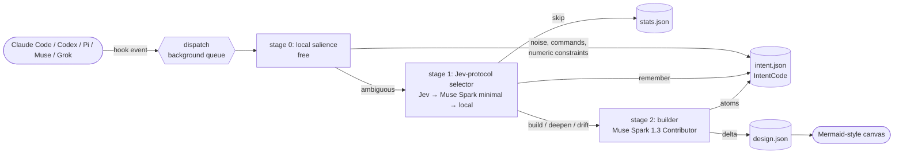

# How Smartypants thinks

Smartypants sits beside a coding agent. Every user turn and every file edit arrives as a
hook event. The job is to keep three things current at the lowest possible cost:

- **the diagram**: `.smartypants/design.json`, system → component → module, with flows;
- **the intent**: `.smartypants/intent.json`, the user's architectural intent as IntentCode atoms;
- **the drift**: flags where delivered code departs from that intent.

## The Jev + Mercury pattern, with Meta

WindTunnel's best configuration (`results/2026-09-18-jev-mercury`) splits an agent into a
**selector** that only picks from a closed menu with a calibrated confidence (Jev), and a
**writer** that fills structured arguments only after the choice is made (Mercury). Picking is
cheap and fast; writing is where tokens go, so writing happens only when needed.

Smartypants applies the same split to design memory:

| WindTunnel | Smartypants |
|---|---|
| menu of page actions | menu per turn: `signal` (arch, constraint, detail, drift, noise), `impact` (none, annotate, extend, restructure), `level` (system, component, module), `target` (which node), `verdict` for edits (conforms, diverges, new-boundary, not-architectural) |
| Jev chooses the action | `src/jev.js`: Typesafe Jev (`/v1/systemone`, `jev-latest`) when `TYPESAFE_API_KEY` is set |
| Mercury writes the arguments | the builder flavor writes the delta; `meta` (Muse Spark 1.3 Contributor) by default |
| `minConfidence` abstains | an unsure "noise" is built anyway; only a confident skip skips |

When no Jev key is present, `metaChooser` asks Muse Spark the **same menus** in one batched
call at `reasoning_effort: minimal`, with a strict JSON schema whose answers are enum keys
(`c0`, `c1`, …). Questions answered with confidence under 0.6 are re-asked at `low` effort,
so extra reasoning is spent only where it is needed. Any selector failure falls through to the
next one; the local heuristic never fails, so a provider outage never blocks a turn.

## The four questions

### Does this change the design?

1. **Stage 0** handles the obvious cases locally: greetings, "run the tests", "commit that",
   slash commands; the first design turn of an empty diagram; a turn that is only numbers
   and guarantees ("p99 under 50ms, 10B redirects a month").
2. **Stage 1** answers `impact`. `none` → skip, `annotate` → store atoms without a builder
   call, `extend`/`restructure` → build.
3. **Stage 2** returns a *delta*: only new or changed nodes and flows plus explicit
   `removeNodeIds`/`removeConnectionIds`. `applyDesign` compares a snapshot of the result to
   the stored design, so "did it change" is exact, not a guess.

### Did the implementation stray from the intent?

- Quiet edits never reach a model: tests (`*.test.*`, `*_test.go`, `test_*.py`), docs,
  lockfiles, config, and tiny diffs.
- Other edits are mapped to candidate owner nodes from their path words, then the selector
  gives a `verdict`. `conforms`/`not-architectural` with confidence ≥ 0.6 stop there.
- `diverges`/`new-boundary` go to the drift builder, which sees only the owner nodes (with
  their `why`) and the intent atoms for those subjects, not the whole graph.
- A divergence becomes a flag on the node and a `!` atom in the intent memory.

**Evolution vs drift** is decided by *who* changed things. A user turn that reverses a
decision is evolution: the new `D` atom supersedes the old one, and the old choice is kept as
an `X` (excluded) atom. Code that contradicts a `D`, `N`, or `X` atom is drift.

### How is intent stored compactly?

See [INTENTCODE.md](INTENTCODE.md). In short: typed, keyed atoms with no grammar, rendered
grouped by subject, evicted by value per token under a 1,200-token budget.

### Is a turn worth remembering?

A turn is worth remembering when it carries **information gain**: an atom whose key is new
or whose value changed. Repeating a known fact only reinforces it (`n += 1`), which raises
its eviction value but adds no tokens. The selector's `signal` separates durable architecture
(`arch`, `constraint`, `detail`) from `noise` (logistics, tooling, chit-chat) and from
user-reported `drift`. The held-out benchmark in `results/2026-09-26-meta-jev` measures this.

## Levels: where to start and when to go deeper

`depth: "auto"` (the default for new projects) picks the first level from what the user said:

| the user said | start |
|---|---|
| a product name or one line | `system` |
| parts, requirements, or scale | `component` |
| internals: schemas, shard keys, sketches, algorithms | `module` |

The level only rises: a later turn that talks about parts lifts `system` to `component`.
When 60% of the boxes at the current level are expanded, the global level moves down one step.

**Going deeper** happens three ways:

- the user says it: "go deeper on the aggregator", "zoom into the cache", "tell me more about
  the key range service", `/smartypants:deeper <part>`, `npx smartypants deeper <part>`, or a
  double-click on the canvas;
- the target is ambiguous: the selector picks among the closest nodes;
- **pressure**: when intent atoms and drift flags pile up on an unexpanded node
  (N/D/F/X atoms count 1, flags 2, a turn that mentions the node with internals 2) and the
  score reaches `autoDeepen` (default 3), Smartypants expands it after the turn. One node per
  turn, and never a node that already has children (or notes, for a module).

A system expands into components, a component into modules, and a module into terse
deep-dive `notes` (data model, algorithm, partitioning, failure handling, capacity math) that
the canvas shows under "read more".

## Background mode

Muse Spark builder calls take 10–40 s. With `"background": true` (the default from `init`)
the hook appends the event to `.smartypants/queue.jsonl`, spawns a detached worker, and exits
at once. One worker per project drains the queue in order under `worker.lock`, so turns never
race on `design.json`. The canvas server submits `go deeper` requests through the same queue.
