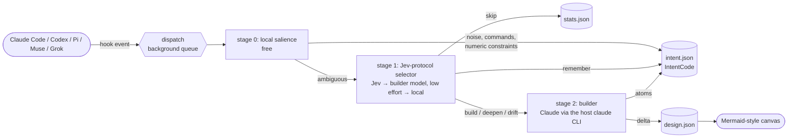

# How Smartypants thinks

Smartypants sits beside a coding agent. Every user turn and every file edit arrives as a
hook event. The job is to keep three things current at the lowest possible cost:

- **the diagram**: `.smartypants/design.json`, system → component → module, with flows;
- **the intent**: `.smartypants/intent.json`, the user's architectural intent as IntentCode atoms;
- **the drift**: flags where delivered code departs from that intent.

```mermaid
flowchart LR
  host(["Claude Code / Codex / Pi / Muse / Grok"]) -->|"hook event"| dispatch{{"dispatch<br/>background queue"}}
  dispatch --> s0["stage 0: local salience<br/>free"]
  s0 -->|"noise, commands,<br/>numeric constraints"| memory[("intent.json<br/>IntentCode")]
  s0 -->|"ambiguous"| s1["stage 1: Jev-protocol selector<br/>Jev → builder model, low effort → local"]
  s1 -->|"skip"| stats[("stats.json")]
  s1 -->|"remember"| memory
  s1 -->|"build / deepen / drift"| s2["stage 2: builder<br/>Claude via the host claude CLI"]
  s2 -->|"delta"| design[("design.json")]
  s2 -->|"atoms"| memory
  design --> canvas(["Mermaid-style canvas"])
```

## The Jev + Mercury pattern, with Claude

WindTunnel's best configuration (`results/2026-09-18-jev-mercury`) splits an agent into a
**selector** that only picks from a closed menu with a calibrated confidence (Jev), and a
**writer** that fills structured arguments only after the choice is made (Mercury). Picking is
cheap and fast; writing is where tokens go, so writing happens only when needed.

Smartypants applies the same split to design memory:

| WindTunnel | Smartypants |
|---|---|
| menu of page actions | menu per turn: `signal` (arch, constraint, detail, drift, noise), `impact` (none, annotate, extend, restructure), `level` (system, component, module), `target` (which node), `verdict` for edits (conforms, diverges, new-boundary, not-architectural) |
| Jev chooses the action | `src/jev.js`: Typesafe Jev (`/v1/systemone`, `jev-latest`) when `TYPESAFE_API_KEY` is set |
| Mercury writes the arguments | the builder flavor writes the delta; `claude` by default, through the host's own `claude` CLI and sign-in |
| `minConfidence` abstains | an unsure "noise" is built anyway; only a confident skip skips |

When no Jev key is present (or Jev is unreachable), the builder's own model answers the **same
menus** in one batched call with a strict JSON schema whose answers are enum keys (`c0`, `c1`, …):
`claudeChooser` asks Claude at `low` effort for the `claude` flavor, and `metaChooser` asks Muse
Spark at `reasoning_effort: minimal` (re-asking questions under 0.6 confidence at `low`) when a
Meta key is set for the other flavors. Any selector failure falls through to the
next one; the local heuristic never fails, so a provider outage never blocks a turn.

## The four questions

### Does this change the design?

1. **Stage 0** handles the obvious cases locally: greetings, "run the tests", "commit that",
   slash commands; the first design turn of an empty diagram; a turn that is only numbers
   and guarantees ("p99 under 50ms, 10B redirects a month").
2. **Stage 1** answers `impact`. `none` → skip, `annotate` → store atoms without a builder
   call, `extend`/`restructure` → build.
3. **Stage 2** returns a *delta*: only new or changed nodes and flows plus explicit
   `removeNodeIds`/`removeConnectionIds`. `applyDesign` compares a snapshot of the result to
   the stored design, so "did it change" is exact, not a guess.

### Did the implementation stray from the intent?

- Quiet edits never reach a model: tests (`*.test.*`, `*_test.go`, `test_*.py`), docs,
  lockfiles, config, and tiny diffs.
- Other edits are mapped to candidate owner nodes from their path words, then the selector
  gives a `verdict`. `conforms`/`not-architectural` with confidence ≥ 0.6 stop there.
- `diverges`/`new-boundary` go to the drift builder, which sees only the owner nodes (with
  their `why`) and the intent atoms for those subjects, not the whole graph.
- A divergence becomes a flag on the node and a `!` atom in the intent memory.

**Evolution vs drift** is decided by *who* changed things. A user turn that reverses a
decision is evolution: the new `D` atom supersedes the old one, and the old choice is kept as
an `X` (excluded) atom. Code that contradicts a `D`, `N`, or `X` atom is drift.

### How is intent stored compactly?

See [INTENTCODE.md](INTENTCODE.md). In short: typed, keyed atoms with no grammar, rendered
grouped by subject, evicted by value per token under a 1,200-token budget.

### Is a turn worth remembering?

A turn is worth remembering when it carries **information gain**: an atom whose key is new
or whose value changed. Repeating a known fact only reinforces it (`n += 1`), which raises
its eviction value but adds no tokens. The selector's `signal` separates durable architecture
(`arch`, `constraint`, `detail`) from `noise` (logistics, tooling, chit-chat) and from
user-reported `drift`. The held-out benchmark in `results/2026-09-26-meta-jev` measures this.

## Levels: where to start and when to go deeper

`depth: "auto"` (the default for new projects) picks the first level from what the user said:

| the user said | start |
|---|---|
| a product name or one line | `system` |
| parts, requirements, or scale | `component` |
| internals: schemas, shard keys, sketches, algorithms | `module` |

The level only rises: a later turn that talks about parts lifts `system` to `component`.
When 60% of the boxes at the current level are expanded, the global level moves down one step.

**Going deeper** happens three ways:

- the user says it: "go deeper on the aggregator", "zoom into the cache", "tell me more about
  the key range service", `/smartypants:deeper <part>`, `npx smartypants deeper <part>`, or a
  double-click on the canvas;
- the target is ambiguous: the selector picks among the closest nodes;
- **pressure**: when intent atoms and drift flags pile up on an unexpanded node
  (N/D/F/X atoms count 1, flags 2, a turn that mentions the node with internals 2) and the
  score reaches `autoDeepen` (default 3), Smartypants expands it after the turn. One node per
  turn, and never a node that already has children (or notes, for a module).

A system expands into components, a component into modules, and a module into terse
deep-dive `notes` (data model, algorithm, partitioning, failure handling, capacity math) that
the canvas shows under "read more".

## Layout convention

The canvas uses one layered convention, drawn from 2026 cloud and C4-style reference diagrams:
who calls sits at the top, where data rests sits at the bottom, the request journey runs left
to right inside a layer, and network or trust boundaries are frames.

| row | tiers | order inside the row |
|---|---|---|
| Users and clients | `client` | journey |
| Edge | `edge` | journey |
| Frontend | `frontend` | journey |
| API | `api` | journey |
| Services | `service`, `platform`, `external` | journey; third parties pushed to the right edge |
| Async | `messaging`, `worker` | streams first, then their consumers |
| Data | `cache`, `database` | caches first, beside the databases they front |
| Storage | `storage` | journey |

Journey order walks the flows breadth-first from the top-most callers, then each row is pulled
toward the parts it talks to (median of neighbours) without overlaps. A row with more than six
boxes, or one that would make the picture over twice as wide as tall, wraps into sub-rows:
callers inside the row above the parts they call, otherwise even rows in journey order, under
one row label. Components with modules are subgraphs: the frame carries the component's title in
a side panel, and its modules sit inside in the same order. Once a subgraph is open, the
component's own arrow to X is dropped when one of its modules already draws a flow to X.

Arrows leave the bottom of a caller and enter the top of the callee; a request and its reply run
as a parallel pair on adjacent ports; long runs use the gaps between rows, spread onto separate
tracks, and gap heights are sized to the arrows they carry. Labels go where they hit no box or
other label, else they show on hover or selection. Each boundary is one outline around its parts
and never overlaps another. Everything sits on an 8px grid. `tier` and `zone` come from the
builder; when a part has no tier it is inferred from its shape and name.

## Knowing the code

`src/scan.js` maps a repository without a model: units from manifests, notable dependencies,
routes, tables, topics, endpoint environment variables, and third-party hosts; then compose,
Kubernetes (including Ingress, NetworkPolicy, Gateway, namespaces), Helm (Chart, values,
template kinds, subcharts), and Terraform. `boundaries()` turns those into lines such as
`public entry: Ingress shop hosts shop.example.com routes /api->orders-api`.

- **Catch-up** (`src/catchup.js`, event `catchup`): scan → one reader call per code unit (key
  files first: manifest, entry points, routers, schema) → one synthesis call at `medium` effort.
  Progress goes to `.smartypants/catchup.json`; a running or finished catch-up replaces the quick
  path-sketch seed.
- **Turn-end review** (`src/turnend.js`, event `turn-end` from `Stop` / `agent_end`): changed files
  come from `git status`, commits since the last review, and a content-hash ledger, so each change
  is reviewed once. Quiet paths cost nothing; the rest share one selector call with a question per
  file; diverging files share one drift check; infrastructure changes and new boundaries share one
  design sync with a fresh scan. With `review: "turn"`, single edits are not checked on their own.

## How the claude builder connects

`src/claude.js` runs the host's Claude Code binary (`CLAUDE_CODE_EXECPATH` inside a Claude Code
hook, `SMARTYPANTS_CLAUDE_BIN` if set, else `claude` on PATH) as
`claude -p --output-format json --json-schema <schema> --system-prompt-file <tmp> --tools ""
--setting-sources "" --strict-mcp-config --disable-slash-commands --no-session-persistence
--permission-mode dontAsk`. The prompt goes on stdin. The child inherits the environment minus
the parent-session markers (`CLAUDECODE`, `CLAUDE_CODE_SESSION_ID`, `CLAUDE_CODE_ENTRYPOINT`), so it
authenticates the same way the host does: `ANTHROPIC_API_KEY`/`ANTHROPIC_AUTH_TOKEN`, Bedrock,
Vertex, or Foundry switches, a gateway on `ANTHROPIC_BASE_URL`, or the stored login. With no
settings sources the child loads no hooks or plugins, so it cannot re-enter Smartypants; it also
has no tools, so it cannot touch the project. `structured_output`, `total_cost_usd`, and
`modelUsage` from the JSON result feed `stats.json`.

## Background mode

Builder calls take 10–40 s. With `"background": true` (the default from `init`)
the hook appends the event to `.smartypants/queue.jsonl`, spawns a detached worker, and exits
at once. One worker per project drains the queue in order under `worker.lock`, so turns never
race on `design.json`. The canvas server submits `go deeper` requests through the same queue.
